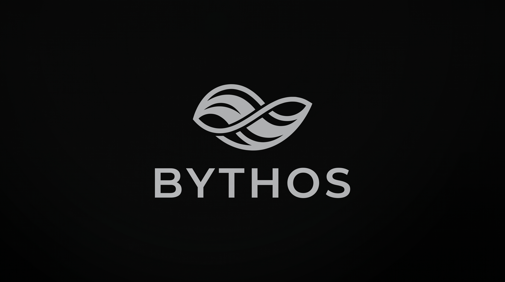

<p align="center">
  
</p>

<h1 align="center">Bythos — tu biblioteca personal, en tu PC</h1>

<p align="center">
  Guarda lo que quieres aprender. Estúdialo. Repásalo.<br>
  Sin nube, sin cuentas, sin ruido.
</p>

## El problema que resuelve

Hoy estamos tapados de información: videos de YouTube a medias, artículos abiertos en 20 pestañas, hilos guardados que jamás vuelven a abrirse. El conocimiento queda disperso en mil lugares y estudiar se vuelve imposible.

**Bythos ataca eso de frente:** un solo lugar donde guardas todo lo que quieres aprender, lo organizas por temas, marcas cuánto avanzaste en cada cosa y lo repasas cuando quieras — incluso con ayuda de la IA.

## Qué hace

- 💾 **Guardar en 1 clic** desde el navegador con la extensión (sin copiar ni pegar links).
- 🗂️ **Carpetas por tema** con filtro Todas / En curso / Completadas.
- 📊 **Progreso real**: cada link lleva su % (0–100), cada carpeta muestra su promedio y el dashboard muestra tu avance global.
- 🔍 **Metadata automática**: al guardar una URL, Bythos detecta título, imagen y tipo (video, artículo, otro).
- 🤖 **Repaso con IA**: exporta tu carpeta en 4 formatos (notas, Gemini, NotebookLM, Drive) y trae el progreso de vuelta con import-avance.
- 📦 **App de 1 archivo**: un solo `.exe` que lleva la interfaz adentro. Doble clic y listo.

## 100 % local, tus datos son tuyos

Todo vive en tu disco, en `bythos.db` dentro de tu carpeta de configuración. No hay login, no hay servidor, no hay telemetría. Google solo ve lo que **tú** decides pegarle al repasar. Nada sale solo.

## Empieza en 2 minutos

1. **Descarga y abre la app** (o compilala abajo): se abre tu biblioteca en `http://localhost:8080`.
2. **Instala la extensión** (ver pasos abajo): verás el icono B en tu barra del navegador.
3. **Guarda tu primer link**: abre cualquier video o artículo, pulsa 💾 **Guardar esta página**, elige la carpeta.
4. **Verificación**: el link aparece en la app con su título e imagen. Marca tu avance y mira cómo sube la barra. ✅

## Cómo correrlo (desarrollo)

Requisitos: Go 1.25+ y (para la UI) Node 18+ con pnpm 9 (o npm).

```powershell
# 1. App completa → http://localhost:8080 (API en /api/salud)
cd desktop
go run .

# 2. UI en desarrollo → http://localhost:5173 (proxy a :8080, cero cambios de código)
cd desktop/ui
pnpm install
pnpm dev

# 3. Ejecutable de 1 archivo (la UI va DENTRO del .exe, una sola puerta :8080)
cd desktop/ui
pnpm build
cd ..
go build -o bythos.exe .
.\bythos.exe
```

Sin `pnpm build`, la raíz `/` te avisa en español qué hacer (no un 404 mudo).

## Instalador Windows

El instalador copia la app a `%LocalAppData%\Bythos`, crea el acceso directo "Bythos" en el Escritorio + entrada en el menú inicio, y deja `uninstall.bat` para quitarlo. Tu base de datos NO viaja: se crea sola en `%APPDATA%\Bythos\bythos.db` al abrir la app.

Es Go puro a propósito (`installer/main.go`, sin dependencias ni Inno Setup): los accesos directos se crean con WSH, que resuelve el Escritorio real aunque esté redirigido a OneDrive.

```powershell
# Compilar el instalador (el setup pesa ~21 MB y no se commitea, ver .gitignore)
cd desktop/ui
npm run build
cd ..
go build -o bythos.exe .
Copy-Item bythos.exe ..\installer\payload\bythos.exe -Force
cd ..\installer
go build -o Bythos-Setup.exe .
```

Instalar: doble clic en `Bythos-Setup.exe` (o `Bythos-Setup.exe /S` en silencio). Probar sin tocar tu Escritorio: `Bythos-Setup.exe -dir <carpeta-temp> -no-shortcuts -silent`.

## Extensión (guardar sin copiar links)

1. Prende la app (`go run .` o el `.exe`): `localhost:8080` eres tú mismo, debe estar vivo.
2. Abre `chrome://extensions` → activa el **modo desarrollador** → **"Cargar descomprimida"** → elige la carpeta `extension/` de este repo.
3. Fija el icono 🅱️ en tu barra para tenerlo a mano.
4. En cualquier video o artículo pulsa 💾 **Guardar esta página** (elige la carpeta, la ves en la app) o el botón Bythos que aparece en la propia página.
5. Si la app está apagada, el popup te lo dice ("Abre primero tu app") en vez de fallar en silencio.

Permisos mínimos a propósito: `activeTab` (solo la pestaña que clicas) + `storage` (tu carpeta favorita) + `http://localhost:8080/*` (solo tu PC, nadie más).

## API local (toda en localhost:8080, sin login: es tu PC)

| Método | Ruta | Hace |
|---|---|---|
| GET | /api/salud | ¿sigo vivo? `{"ok":true,"version":"1.0.0"}` |
| GET/POST | /api/carpetas | listar / crear `{nombre}` |
| DELETE | /api/carpetas/{id} | borrar (con sus recursos) |
| GET | /api/carpetas/{id}/progreso | `{total, completados, porcentaje, promedio}` |
| GET/POST | /api/recursos | listar (`?carpeta_id=`) / guardar `{carpeta_id, url}` |
| PATCH | /api/recursos/{id} | avance `{progreso: 0-100}` o estado |
| DELETE | /api/recursos/{id} | borrar |
| GET | /api/stats | avance global (dashboard) |
| GET | /api/carpetas/{id}/export?format= | `markdown` · `gemini` · `notebooklm` · `drive` |
| POST | /api/carpetas/{id}/import-avance | trae el % de vuelta desde el texto repasado |
| GET | / | tu biblioteca (o aviso si falta `pnpm build`) |

## Repaso (a dónde va cada export)

- **Markdown**: lista `[título](url)` con % para tus notas/Obsidian (botón Copiar en la UI).
- **Gemini**: tus links + órdenes (resumen, preguntas, plan de 7 días) para pegar en `gemini.google.com`.
- **NotebookLM**: pasos + URLs para importar en `notebooklm.google.com`.
- **Drive**: el mismo Markdown como archivo `bythos-<carpeta>.md` (el navegador lo descarga, tú lo subes).

## Tests

```powershell
cd desktop
go vet ./...  # compilación sana
go test ./... # API + base de datos, todo en segundos
```

## Mapa (dónde vive cada cosa y por qué)

```
bythos/
  assets/                         → logo e iconos (icon.svg fuente, PNGs, favicon)
  desktop/                        → el programa descargable (.exe de 1 archivo)
    main.go                       → director: abre .db + incrusta UI + prende :8080
    db/                           → memoria (SQL solo aquí) + tests
    api/                          → cerebro (HTTP, sin SQL) + tests
    ui/                           → cara: React + Vite (src/{api.js, App.jsx, ...})
    ventana/                      → abre la app en modo ventana (Edge --app)
  extension/                      → brazo: manifest.json + popup + content script + iconos
```

Reglas que cumplimos: `main` flaco · SQL solo en `db/` · la UI y la extensión nunca tocan el `.db` (hablan HTTP) · la extensión manda solo `{url}` y Go detecta título/imagen/tipo.

## Roadmap

- [x] Guardar con metadata + carpetas + progreso + export 4 formatos + UI + extensión + `.exe` + tests + iconos
- [ ] Instalador con icono en el `.exe` (ver `assets/README.md`)
- [ ] Chequeo de actualizaciones desde la app
- [ ] Tests de UI (vitest)

## Licencia

MIT — ver [LICENSE](LICENSE). Bythos es open source: puedes usarlo, modificarlo y distribuirlo libremente.
