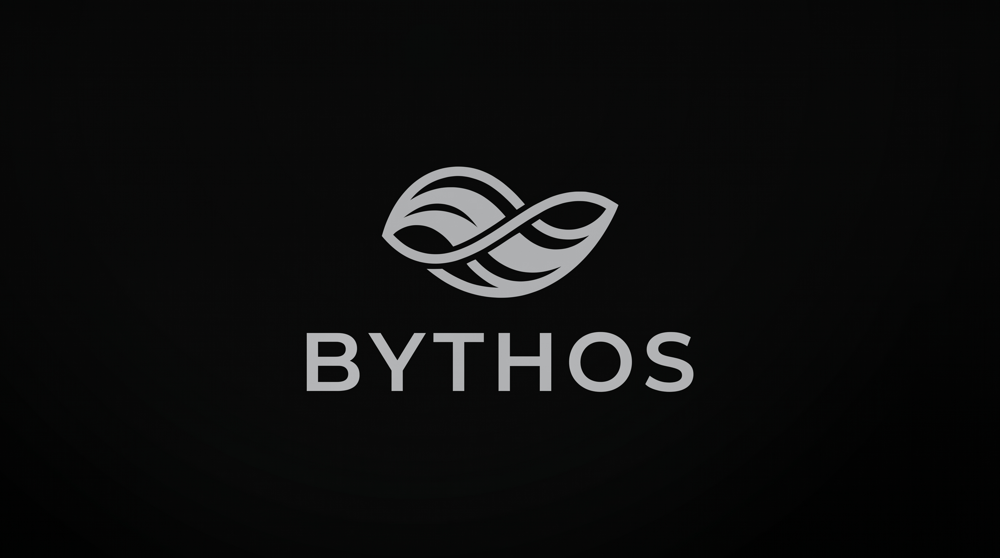
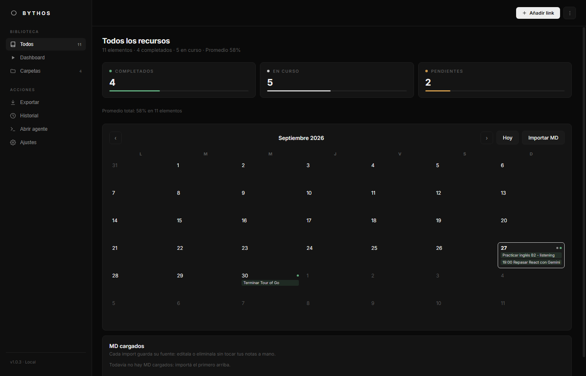

  

<h1 align="center">Bythos</h1>

  Tu biblioteca personal de estudio, en tu PC. Sin nube, sin cuentas, sin ruido.

  
  
  

> ### ⬇ Descargar Bythos para Windows
>
> **[Descargar Bythos-Setup.exe (última versión)](https://github.com/GermanVelazquez/Bythos/releases/latest/download/Bythos-Setup.exe)**
>
> Doble clic para instalar, no pide permisos de administrador. Si Windows
> muestra SmartScreen, pulsa "Más información" → "Ejecutar de todas formas"
> (es normal en apps nuevas sin firma pagada; el código es público, lo puedes
> revisar en este repositorio).

  

## Qué puedes hacer

| | |
|---|---|
| 💾 **Guardar en 1 clic** | Desde el navegador, con la extensión. Sin copiar ni pegar links. |
| 🗂️ **Organizar por temas** | Carpetas para React, Inglés, lo que estés estudiando. |
| 📊 **Ver tu progreso real** | Cada link tiene su %, cada carpeta su promedio. |
| 📅 **Planear con calendario** | Agenda tus sesiones de estudio y mira tu historia de avance. |
| 🤖 **Estudiar con IA** | Exporta a Gemini o NotebookLM, y trae el progreso de vuelta. |
| 🧑‍💻 **Conectar tu propio agente** | Claude Code, OpenCode, Codex o Gemini CLI pueden ayudarte a organizar tu biblioteca. |

## Empieza en 3 pasos

**1. Instala la app** — descarga `Bythos-Setup.exe` arriba y ábrelo. Se
instala en tu usuario, sin admin, y abre tu biblioteca en su propia ventana.

**2. Instala la extensión** — la encuentras ya en tu Escritorio, en la
carpeta `Bythos-Extension` (con su guía `LEEME.txt`). En Chrome:

1. Abre `chrome://extensions`
2. Activa **Modo desarrollador** (arriba a la derecha)
3. Pulsa **Cargar descomprimida** y elige la carpeta `Bythos-Extension`

**3. Guarda tu primer link** — abre cualquier video o artículo, pulsa 💾
**Guardar esta página**, elige una carpeta. Aparece en la app con su título
e imagen. Marca tu avance y mira cómo sube la barra. ✅

## Estudia con tu agente de IA

Si usas un agente de IA en tu terminal (Claude Code, OpenCode, Codex,
Gemini CLI), puedes conectarlo a tu biblioteca de Bythos: puede leer tus
carpetas, actualizar tu progreso y armarte notas en la agenda, todo
hablando contigo mientras estudias.

1. Pulsa **Abrir agente** en el sidebar de la app.
2. Se abre una terminal ya lista. Escribe `claude`, `opencode` o `gemini`.
3. Pídele lo que necesites: "resume mi progreso en React", "crea una nota
   para repasar el martes", "guarda este link en Go".

Tu agente **no puede borrar nada** — solo agregar y actualizar. Y todo lo
que hace queda anotado en la vista **Historial**, para que sepas siempre
qué tocó y cuándo.

Guía completa (configuración manual, lista de herramientas, cómo funciona
por dentro): [docs/AGENTES.md](docs/AGENTES.md).

## Tus datos son tuyos

- **Todo vive en tu disco.** Un solo archivo (`bythos.db`) en tu carpeta de
  configuración de Windows. Sin login, sin servidor externo, sin telemetría.
- **Nada sale sin que tú decidas.** Solo cuando eliges repasar con Gemini o
  NotebookLM, tú mismo pegas el texto — Bythos nunca lo manda por ti.
- **Si usas un agente de IA, tú eliges quién lo ve.** Lo que el agente lee
  de tu biblioteca viaja al proveedor del modelo que elegiste; con un modelo
  local (por ejemplo, con Ollama) no sale de tu PC.
- **Puedes revisar el código.** Es 100% open source, bajo licencia MIT.

## Preguntas frecuentes

Windows me muestra una advertencia (SmartScreen), ¿es seguro instalar?

Sí. SmartScreen avisa sobre cualquier programa nuevo que no pagó una firma
de código (un trámite caro, no una garantía de seguridad). Bythos es
software libre: puedes leer el código completo en este repositorio antes de
instalar. Pulsa "Más información" → "Ejecutar de todas formas" para continuar.

¿Dónde se guardan mis datos?

En tu propia PC, en `%APPDATA%\Bythos\bythos.db`. Ese archivo se crea solo
la primera vez que abres la app — no viaja con el instalador ni se sube a
ningún lado.

La extensión dice que la app está cerrada, ¿qué hago?

Abre Bythos primero (el acceso directo del Escritorio o del menú inicio) y
espera a que se abra la ventana de tu biblioteca. La extensión necesita
que la app esté corriendo para guardar links.

¿Cómo desinstalo Bythos?

Desde "Agregar o quitar programas" de Windows, busca "Bythos" y
desinstala. Te va a preguntar si también quieres borrar la carpeta
`Bythos-Extension` del Escritorio (puedes conservarla si prefieres).

¿Necesita internet?

Solo para dos cosas puntuales: leer el título/imagen de un link que
guardas, y hablar con el proveedor de IA que tú elijas al estudiar (Gemini,
NotebookLM, o tu agente de IA si usas uno). El resto — tu biblioteca, tu
progreso, tu agenda — funciona 100% local, sin conexión.

## ¿Eres desarrollador?

Si quieres compilar Bythos, correrlo en modo desarrollo, o entender cómo
está armado por dentro, toda la documentación técnica vive en
[docs/DESARROLLO.md](docs/DESARROLLO.md) (arquitectura, API local, tests,
instalador) y [docs/AGENTES.md](docs/AGENTES.md) (integración MCP a fondo).

## Licencia

MIT — ver [LICENSE](LICENSE). Bythos es open source: puedes usarlo,
modificarlo y distribuirlo libremente.

Hecho por [German Velazquez](https://github.com/GermanVelazquez).
